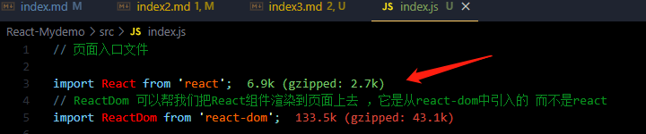
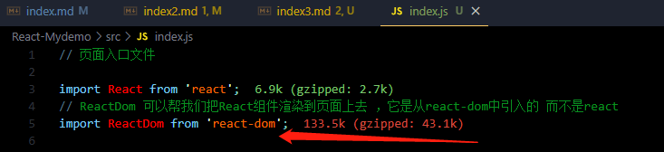
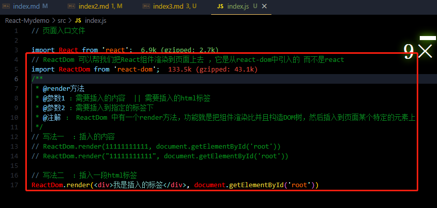

# 基础知识

### 入口文件
>
> index.js

+ 1. **React模块**

> `import React from 'react';`
>
> 在React 16版本之前如果想写JSX语法就需要导入React模块，16版本以后就不强制导入模块


+ 2. **react-dom模块**

> `import ReactDom from 'react-dom';`
>
> ReactDom 可以帮我们将 React组件 渲染到页面上去，它是从 `react-dom`模块导入的，而不是 `React`模块


+ 3. **render函数**

> 是 `ReactDom` 上的一个方法 功能就是将组件 渲染并构造在DOM树上，然后插入到页面的某个指定元素上
::: tip render方法有两个参数

+ 参数一 ：需要插入的  `组件 | 标签 | 内容`
+ 参数二 : 需要指定 `标签`

```
import ReactDom from 'react-dom';
// 写法一  ：插入内容
ReactDom.render(11111,document.getElementById('root'))
// 写法二  ：插入标签
ReactDom.render(<div>我是插入的标签</div>, document.getElementById('root'))
```


:::
