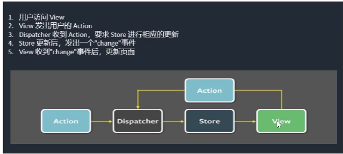
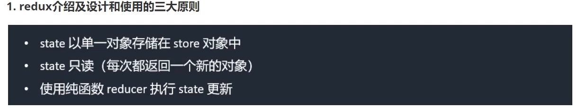

# 进阶知识 - Redux

### Flux 与 Redux

+ **Flux** :

> `Flux` 是一种架构思想，专门解决软件的结构问题。 这种思想衍生出来多种全局数据状态共享种方案(至少15种)，Flux地址:['https:/igithub.com/voronianski/flux-comparison'](https:/igithub.com/voronianski/flux-comparison)



+ **Redux** :

> `Redux` 是 Flux 架构思想下衍生出来的一种方案，可以全局管理数据，操作方法。简单快捷好上手

### Redux

+ **简介**

 `redux` 最主要的作用是应用状态的管理。简单来说, `redux` 用一个单独的常亮状态数据数(`state对象`),保存这一整个应用的状态，这个对象不能直接被改变。一旦有某些数据被改变，一个新的`state对象` 就会被创建(使用 `actions` 和 `reducers`),这样就可以进行数据追踪，完成`Redux`的工作流啦

 其实就是`Reducer + 订阅发布模式` 的结合



+ **安装**

```
npm install redux
```

+ **redux工作流**

